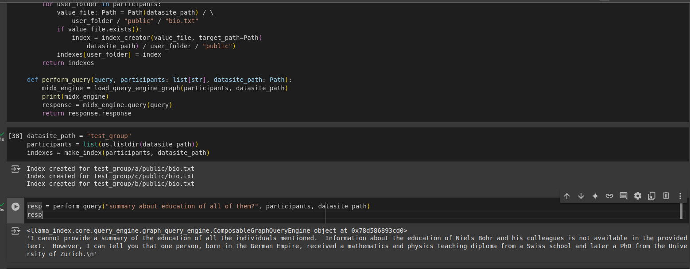

# Federated RAG (Retrievel Augmented Generation)

##### Expectations
```
1. Expects a bio.txt (with any of your info) in public folder
2. Uses open-source LLM and Embedding model
3. For each user creates a index and store in public folder
4. For a given query makes a multi-query engine through a composed graph.
5. CLI based user-query
```


##### for isolated test of code
```
1. install requirements.txt
2. Comment out syftbox relevant main part of code in main.py file.
3. Uncommment custom test block of code.
4. run main.py
```
